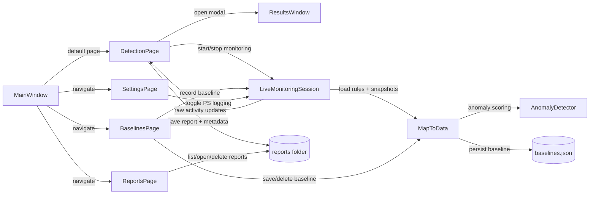

# Frontend Page Interaction UML (Simple)

```mermaid
flowchart LR
    MainWindow[MainWindow]
    DetectionPage[DetectionPage]
    BaselinesPage[BaselinesPage]
    ReportsPage[ReportsPage]
    SettingsPage[SettingsPage]
    ResultsWindow[ResultsWindow]

    LiveMonitoringSession[LiveMonitoringSession]
    MapToData[MapToData]
    AnomalyDetector[AnomalyDetector]

    ReportsFolder[(reports folder)]
    BaselinesJson[(baselines.json)]

    MainWindow -->|default page| DetectionPage
    MainWindow -->|navigate| BaselinesPage
    MainWindow -->|navigate| ReportsPage
    MainWindow -->|navigate| SettingsPage

    DetectionPage -->|start/stop monitoring| LiveMonitoringSession
    LiveMonitoringSession -->|raw activity updates| DetectionPage
    LiveMonitoringSession -->|load rules + snapshots| MapToData
    MapToData -->|anomaly scoring| AnomalyDetector

    DetectionPage -->|save report + metadata| ReportsFolder
    DetectionPage -->|open modal| ResultsWindow

    BaselinesPage -->|record baseline| LiveMonitoringSession
    BaselinesPage -->|save/delete baseline| MapToData
    MapToData -->|persist baseline| BaselinesJson

    ReportsPage -->|list/open/delete reports| ReportsFolder
    SettingsPage -->|toggle PS logging| LiveMonitoringSession
```

Notes:

- This keeps only the main page-to-page and page-to-core-component interactions.
- `Dashboard` in navigation currently opens `DetectionPage`.
